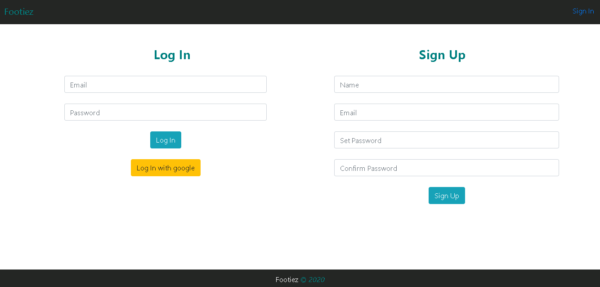

# Footiez

Footiez is a quiz competition related to football. A series of 10 questions are asked for each participant in the competition under a time of 30 seconds. Later a league table is created to determine the best winner. At first, the participant has to create an account and login to enter the competition 

The technologies used to create this application is ReactJs and CSS for the front end of the appication  and Redux for the backend of the program. There are in total of 3 pages of the appication, they are ;

 - The Sign up and Login Page
 - The Information page 
 - The Quiz page

 Here are some of the screenshots of the pages: 

 ## Sign up and Login Page 

 ## The Information Page 

